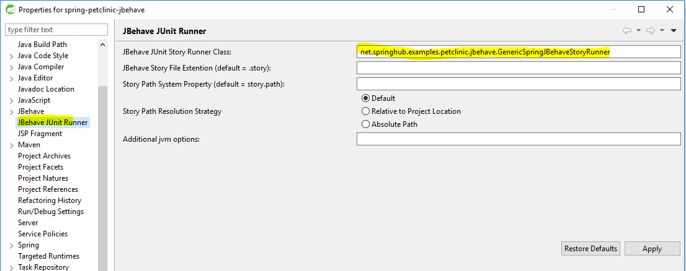

# Eclipse JBehave JUnit Story Runner Plugin#

This plugin allows running JBehave story files as JUnit tests using context menu from Eclipse project explorer view or editor.

## Features ##

- The plugin is integrated with Eclipse's Run As (or Debug As) context menus.
- The context menu appears automatically when right clicking on:  
&nbsp; * A folder containing one or more story files (on project explorer view)  
&nbsp; * A story file (on project explorer view) 
&nbsp; * A story editor

##  Installation ##
[Get](https://github.com/obeimnet/releases/blob/master/tech.idehub.eclipse.jbehave.update-site-2.0.0.RC1.zip?raw=true) a zipped file and install it into eclipse from a local update archive.

## How it Works ##

- The plugin sets the path of selected story file (or folder containing story files) as a system property (default: story.path).
- A custom JBehave JUnit runner class reads the system property.
- You will need to provide a custom JBehave JUnit runner class as in the following example:

**Example:**
<pre>
  import org.jbehave.core.junit.JUnitStories
  @RunWith(......)
  public class MyStoryRunner extends JUnitStories {
   @Override
   protected List&lt;String&gt; storyPaths() {
	   List&lt;String&gt; stories = new ArrayList&lt;&gt;();
       stories.add(System.getProperty("story.path"));
       return stories;
   }
 }
</pre>

## Configuring the Plugin ##

- After installation, right click on a project containing JBehave stories and open project properties window

- On the project properties page, locate 'JBehave JUnit Runner'.

- Enter custom JBehave JUnit runner class (e.g. net.springhub.examples.petclinic.jbehave.GenericSpringJBehaveStoryRunner)

- There are three options for Story Path Resolution Strategy.
- Using example story file  located in *c:/myWorkspace/myProject1/src/test/resources/myStories/group1/blah.story* :
- **Default**
  - Passes story file name relative to project location.
  - In addition, if the project has default maven settings, maven resource folders will be ignored.
  -  story.path will be set to "myStories/group1/blah.story"
- **Relative to Project Location**
   - story.path will be set to "myStories/group1/blah.story"
- **Absolute Path**
   -  story.path will be set to "c:/myWorkspace/myProject1/src/test/resources/myStories/group1/blah.story"

**Additional jvm options**
- Allows you to pass jvm options, e.g. -Dproperty1=value1

## Supported Platforms ##

The plugin has been tested in the following platforms:

- Java 8
- Eclipse Photon
- Windows 10
